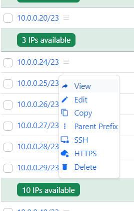

# netbox_contextmenus
Add context buttons to the links, making navigating in netbox less clicky




The menu items can easliy be personalised

## INSTALLATION

- install as a any regular plugin.  See  [https://docs.netbox.dev/en/stable/plugins/installation/](https://docs.netbox.dev/en/stable/plugins/installation/)
- PyPi Packagename is 'netbox-contextmenus'.
- NetBox packagename is 'netbox_contextmenus'.
- restart the netbox service

NBCM is compatible with NetBox v3 and v4.0

---
### IMPORTANT NOTE !
NBCM version <= 1.4.3 used the 'BOTTOM_BANNER' variable to inject the javascript.

As of v1.4.4, the javascript is injected using django middleware.
Make sure to remove the setting from the ConfigRevision BOTTOM_BANNER or from your configuration.py
The nbcm.js file located in /opt/netbox/netbox/netbox/scripts can be removed.

This is a preparation to create a GUI to modifiy the Contect Menu items

---

## CONFIGURATION
These settings can be customized using the PLUGINS_CONFIG variable in 'configuration.py'
```
PLUGINS_CONFIG = {
    'netbox_contextmenus': {
        'nbcmopendelay': 150
    }
}
```
| variable | default | function |
| --- | --- | --- |
| nbcmopendelay | 150 | Time in milliseconds that the opening of the contextmenu will be delayed |
