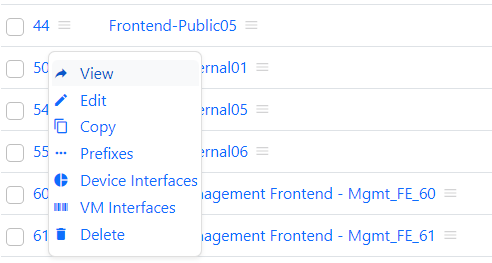
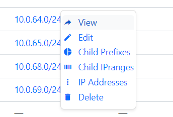

# netbox_contextmenus
Add context buttons to the links, making navigating in netbox less clicky

The menu items can easliy be personalised

## Installation:

- Set the BANNER_BOTTOM in your configuration.py
    BANNER_BOTTOM = ''
- Put this code in /opt/netbox/netbox/media/scripts/nbcm.js
- restart the netbox service

Not a real 'plugin' in the real sense of the word, as it is not using the plugins feature of Netbox.
But rather an 'addon' 
